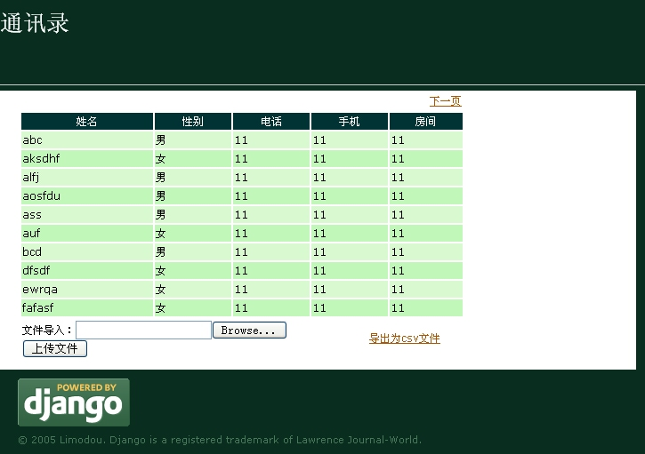

# Django Step by Step (十)

## 1 引言

现在我们看一看所展示出来的页面，你满意吗？还有可以改进的地方。比如性别，它显示出来的直接是数据库的值，而不是对应的“男”，“女”，怎么办。还有表格显示也不是很好看。没说的，改！

最初我想使用 CustomManipulator (Manipulator 是 Django 中用来自动生成元素对应的 HTML 代码的对象，你可以定制它)，但使用 Manipulator 的话，你不能再使用 generic view 了，需要自已去实现 generic view 的某些代码，当然可以 copy and paste，但我目前不想那样做。于是我想到可以扩展 Django 的模板，自定义一个 filter 来实现它。(具体扩展的文档参见 [The Django template language: For Python programmers](https://docs.djangoproject.com/en/2.0/ref/templates/api/) ，你不仅可以扩展filter，还可以扩展 Tag ，还可以设置模板变量，还可以进行块处理等复杂的操作，自已去看吧。)

## 2 创建 address/templatetags 目录

注意，这个目录要在某个应用的下面，同时它应与 models, views.py在同一层目录下。

## 3 创建 address/templatetags/__init__.py 文件

文件为空即可。

## 4 创建自定义模板文件 address/templatetags/change_gender.py

文件名为你想要装入到模板中的名字。如文件起名为 `change_gender.py` ，那么你将可以在模板中使用:

```python

```

来导入。

## 5 编辑 change_gender.py

```python
from django import template

register = template.Library()

@register.filter(name='change_gender')
def change_gender(value):
    if value == 'M':
        return '男'
    else:
        return '女'
```

先是导入 template 模块，然后生成一个 register 的对象，我将用来它注册我所定义的 filter 。我实现的 filter 将命名为 "change_gender" ，它没有参数(一个filter可以接受一个参数，或没有参数)。当 value 为 M 时返回 男 ，当 value 为 F 时返回 女 。然后调用 register 的 filter 来注册它。这里有两种写法，一种是使用 Python 2.4才支持的 decorator (此行注释掉了)，另一种是使用标准的写法。在使用 decorator 时，如果 filter 方法有多个参数的话，需要指明 name 参数，否则可以直接写为:

```python
@register.filter
```

它自动将函数名认为是filter的名字。

## 6 修改 templates/address/address_list.html

```html



<style type="text/css">
h1#title {color:white;}
.mytr1 {background:#D9F9D0}
.mytr2 {background:#C1F8BA}
.myth {background:#003333}
.th_text {color:#ffffff}
</style>
<div id="header">
<h1 id="title">通讯录</h1>
</div>
<hr>
<div id="content-main">
    <table border="0" width="500">
    <tr align="right">
      <td>
        <a href="/address?page={{ previous }}">上一页</a>
         
        <a href="/address?page={{ next }}">下一页</a>
        </td></tr>
    </table>
    <table border="0" width="500" cellspacing="2">
    <tr class="myth">
      <th><span class="th_text">姓名</span></th>
      <th><span class="th_text">性别</span></th>
      <th><span class="th_text">电话</span></th>
      <th><span class="th_text">手机</span></th>
      <th><span class="th_text">房间</span></th>
    </tr>
    
    <tr class="">
      <td>{{ person.name }}</td>
      <td>{{ person.gender|change_gender }}</td>
      <td>{{ person.telphone }}</td>
      <td>{{ person.mobile }}</td>
      <td>{{ person.room }}</td>
    </tr>
    
    </table>
    <table border="0" width="500">
    <tr>
    <td>
    <form enctype="multipart/form-data" method="POST" action="/address/upload/">
    文件导入：<input type="file" name="file"/><br/>
    <input type="submit" value="上传文件"/>
    </form>
    </td>
    <td><p><a href="/address/output/">导出为csv文件</a></p></td>
    </tr>
    </table>
</div>

```

改动了以下几个地方：

1. 增加了   来导入自定义的 filter 。

2. 增加了几个样式，象 `mytr1`, `mytr2` 等。

3. 显示结果的 table 改为:

```html
<table border="0" width="500" cellspacing="2">
```

4. 表头改为:

```html
<tr class="myth">
  <th><span class="th_text">姓名</span></th>
  <th><span class="th_text">性别</span></th>
  <th><span class="th_text">电话</span></th>
  <th><span class="th_text">手机</span></th>
  <th><span class="th_text">房间</span></th>
</tr>
```

增加了样式处理

5. 数据显示的 tr 标签改为:

```html
<tr class="">
```

使用了 cycle Tag 来处理表格行的样式切换。注意： cycle 处理的是字符串。

6. 修改 `{{ person.gender }}` 为 `{{ person.gender|change_gender }}`

## 7 启动 server 进行测试

> 注意，一定要重启。象 templatetags 之类是在导入时处理的，因此如果 server 已经启动再添加的话是不起作用的。其它象增加 app, 修改 settings.py 都是要重启，而修改 urls.py , view, model代码，模板什么的可以不用重启，在必要时 Django 的测试 web server 会自动重启。如果你使用 Apache 的话，估计绝大多数情况下要重启，可能只有修改模板不用吧。不过也仍然可以设置 Apache 以便让每次请求过来时重新装入 Python 模块。

如果一切成功，你会看到 M, F 都改过来了。这里如果你感兴趣还可以改成小图标来表示，点缀一下。

效果画面为：

